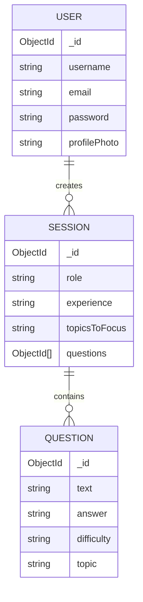

# 🏛️ InterviewPrep AI - Architectural Masterplan

> **Status:** Active Development  
> **Version:** 1.0.0  
> **Date:** December 22, 2025

## 1. 🔭 Vision & Core Philosophy

**InterviewPrep AI** is a high-performance, AI-driven platform designed to simulate technical interviews with extreme latency optimization. The architecture prioritizes **speed** (via Groq LPU), **modularity** (Service-Controller pattern), and **UX fluidity** (React 19 + Framer Motion).

---

## 2. 🛠️ The "Bleeding Edge" Tech Stack

### **Frontend (Client)**

- **Core:** React 19 + Vite 7 (ESM-first)
- **Routing:** React Router 7
- **Styling:** Tailwind CSS v4 + Framer Motion (for "Avant-Garde" micro-interactions)
- **State:** React Context API (Theme, User) + Local State
- **HTTP Client:** Axios (Singleton instance)

### **Backend (Server)**

- **Runtime:** Node.js (ESM Mode)
- **Framework:** Express v5 (Modern routing)
- **Database:** MongoDB + Mongoose v9
- **AI Engine:** **Groq** (LPU Inference) via OpenAI-compatible API
- **Security:** Helmet, RateLimit, CORS, JWT (HttpOnly Cookies)

---

## 3. 📐 System Architecture

The system follows a **Client-Server** architecture with a decoupled AI service layer.

```mermaid
graph TD
    User[👤 User] -->|HTTPS| Client[🖥️ Frontend (React 19)]
    Client -->|REST API| API[🛡️ Backend API (Express v5)]

    subgraph "Backend Services"
        API -->|Auth| AuthC[Auth Controller]
        API -->|Business Logic| SessC[Session Controller]
        API -->|Inference| AIC[AI Controller]
    end

    subgraph "Data Persistence"
        AuthC -->|Read/Write| DB[(MongoDB)]
        SessC -->|Read/Write| DB
    end

    subgraph "External AI Cloud"
        AIC -->|JSON Prompt| Groq[⚡ Groq API (Llama/Mixtral)]
        Groq -->|Structured JSON| AIC
    end
```

---

## 4. 🧠 Backend Architecture (Deep Dive)

### **4.1 Controller-Service Pattern**

The backend is organized into distinct domains. While currently implementing a "Fat Controller" pattern, the logic is separated by feature domain.

- **`aiController`**: Orchestrates the prompt engineering and communication with Groq. It handles the non-deterministic nature of LLMs and enforces JSON structure.
- **`sessionController`**: Manages the lifecycle of an interview (Creation -> Question Generation -> Storage).
- **`authController`**: Handles JWT issuance, hashing (Bcrypt), and cookie management.

### **4.2 The AI Pipeline (Groq Integration)**

We utilize **Groq** for near-instant inference, critical for maintaining the "flow" of an interview.

1.  **Prompt Construction:** Templates in `utils/prompts.ts` inject user context (Role, Experience).
2.  **Request:** Sent to `https://api.groq.com/openai/v1/chat/completions`.
3.  **Sanitization:** The raw string response is parsed via `cleanAndParseJSON` to ensure the frontend receives consumable data.

### **4.3 Database Schema (ERD)**



---

## 5. 🎨 Frontend Architecture (Deep Dive)

### **5.1 Component Hierarchy**

The UI is built on **Atomic Design** principles but adapted for speed.

- **`pages/`**: Route-level containers (Smart Components).
  - `InterviewPrep.tsx`: The main "Game Loop" of the application.
- **`components/`**: Reusable UI elements (Dumb Components).
  - `cards/`: Specialized displays for Questions and Summaries.
  - `loader/`: Skeleton screens to manage perceived performance during AI generation.
- **`layouts/`**: Persistent shells (`DashboardLayout`).

### **5.2 State Management Strategy**

- **Global Server State:** Managed via `useUser` hook (User profile, Auth status).
- **Theme State:** `ThemeContext` for Dark/Light mode toggling.
- **Ephemeral UI State:** Local `useState` for form inputs and modal visibility.

---

## 6. 🔄 Key Workflows

### **6.1 The "Interview Loop"**

This is the core value proposition flow.

1.  **Initiation:** User submits `CreateSessionForm` (Role: "Frontend Dev", Exp: "Senior").
2.  **Generation:**
    - Backend receives request.
    - `aiController` constructs a system prompt enforcing a JSON array of questions.
    - Groq returns the questions.
    - `sessionController` saves the Session and Questions to MongoDB.
3.  **Interaction:**
    - Frontend receives the Session ID.
    - User navigates to `/interview-prep`.
    - Questions are displayed one by one via `QuestionCard`.
4.  **Feedback:**
    - User requests "Explain" or "Reveal Answer".
    - `AIResponsePreview` renders the markdown response.

### **6.2 Authentication Flow**

1.  **Signup/Login:** `authController` validates credentials.
2.  **Token Issue:** A JWT is signed and sent as an **HTTP-Only Cookie** (Security Best Practice).
3.  **Protection:** `authMiddleware` intercepts protected routes, verifies the cookie, and attaches `req.user`.

---

## 7. 📂 Project Structure Map

```text
interviewprepai/
├── backend/                 # 🧠 The Brain
│   ├── config/              # DB, Logger, RateLimiters
│   ├── controllers/         # Business Logic (AI, Auth, Session)
│   ├── models/              # Mongoose Schemas
│   ├── routes/              # API Endpoint Definitions
│   └── utils/               # Prompts & Helper Functions
│
└── frontend/interview-prep-ai/  # 💅 The Face
    ├── src/
    │   ├── components/      # UI Building Blocks
    │   ├── context/         # Global State (Theme)
    │   ├── hooks/           # Custom Logic (useUser)
    │   ├── pages/           # Route Views
    │   └── utils/           # API Clients & Helpers
    └── vite.config.ts       # Build Configuration
```
