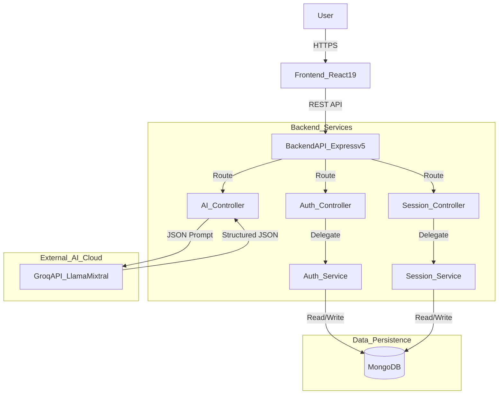
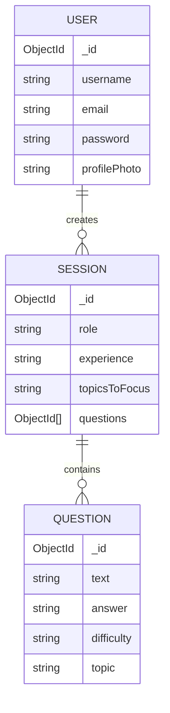
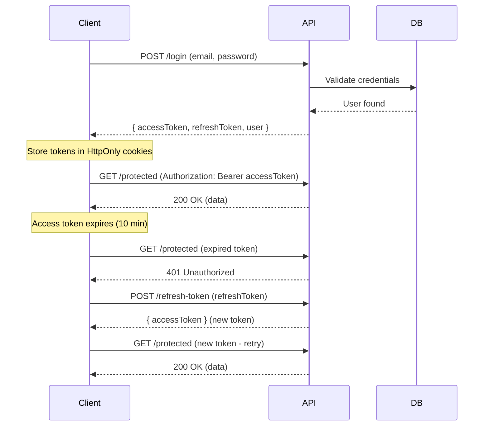

# 🏛️ Interview Trainer AI - Architectural Masterplan

> **Status:** Performance-Audited & Refactored
> **Version:** 1.6.0
> **Date:** January 29, 2026

## 1. 🔭 Vision & Core Philosophy

**Interview Trainer AI** is a high-performance, AI-driven platform designed to simulate technical interviews with extreme latency optimization. The architecture prioritizes **speed** (via Groq LPU), **modularity** (Service-Controller pattern), and **UX fluidity** (React 19 + Framer Motion).

---

## 2. 🛠️ The "Bleeding Edge" Tech Stack

### **Frontend (Client)**

- **Core:** React 19 + Vite 7 (ESM-first)
- **Routing:** React Router 7
- **Styling:** Tailwind CSS v4 + Framer Motion (for "Avant-Garde" micro-interactions)
- **Validation:** **Zod** (Strict schema-based validation)
- **State:** React Context API (Theme, User) + Local State
- **Internationalization:** i18next + native **Intl.DateTimeFormat** (Zero-dependency dates)
- **HTTP Client:** Axios (Singleton instance)

### **Backend (Server)**

- **Runtime:** Node.js (ESM Mode)
- **Framework:** Express v4 (Robust routing)
- **Database:** MongoDB + Mongoose v8
- **AI Engine:** **Groq** (LPU Inference) via OpenAI-compatible API
- **Security:** Helmet, RateLimit, CORS, JWT (HttpOnly Cookies), **Express-Validator**

---

## 3. 📐 System Architecture

The system follows a **Client-Server** architecture with a decoupled AI service layer.


```mermaid
graph TD
User[User] -->|HTTPS| Client[Frontend_React19]
Client -->|REST API| API[BackendAPI_Expressv5]

subgraph Backend_Services
    API -->|Route| AuthC[Auth_Controller]
    AuthC -->|Delegate| AuthS[Auth_Service]
    API -->|Route| SessC[Session_Controller]
    SessC -->|Delegate| SessS[Session_Service]
    API -->|Route| AIC[AI_Controller]
end

subgraph Data_Persistence
    AuthS -->|Read/Write| DB[(MongoDB)]
    SessS -->|Read/Write| DB
end

subgraph External_AI_Cloud
    AIC -->|JSON Prompt| Groq[GroqAPI_LlamaMixtral]
    Groq -->|Structured JSON| AIC
end
```

---

## 4. 🧠 Backend Architecture (Deep Dive)

### **4.1 Controller-Service-Repository Pattern**

The backend has been refactored from "Fat Controllers" to a decoupled **Service Layer** architecture.

- **`Services`**: Encapsulate all business logic, database interactions, and token orchestration.
  - `AuthService`: Handles complex auth flows, token generation/revocation, and password resets.
  - `SessionService`: Manages session lifecycles, question pinning, and note persistence.
- **`Controllers`**: Lean components responsible for HTTP request validation and response mapping.
- **`aiController`**: Orchestrates the prompt engineering and communication with Groq. It handles the non-deterministic nature of LLMs and enforces JSON structure.

### **4.2 The AI Pipeline (Groq Integration)**

We utilize **Groq** for near-instant inference, critical for maintaining the "flow" of an interview.

1. **Prompt Construction:** Templates in `utils/prompts.ts` inject user context (Role, Experience).
2. **Request:** Sent to `https://api.groq.com/openai/v1/chat/completions`.
3. **Sanitization:** The raw string response is parsed via `cleanAndParseJSON` to ensure the frontend receives consumable data.

### **4.3 Database Schema (ERD)**


```mermaid
erDiagram
    USER ||--o{ SESSION : creates
    SESSION ||--o{ QUESTION : contains

    USER {
        ObjectId _id
        string username
        string email
        string password
        string profilePhoto
    }

    SESSION {
        ObjectId _id
        string role
        string experience
        string topicsToFocus
        ObjectId[] questions
    }

    QUESTION {
        ObjectId _id
        string text
        string answer
        string difficulty
        string topic
    }
```

---

## 5. 🎨 Frontend Architecture (Deep Dive)

### **5.1 Component Hierarchy**

The UI is built on **Atomic Design** principles but adapted for speed.

- **`pages/`**: Route-level containers (Smart Components).
  - `InterviewPrep.tsx`: The main "Game Loop" of the application.
- **`components/`**: Reusable UI elements (Dumb Components).
  - `cards/`: Specialized displays for Questions and Summaries.
  - `loader/`: Skeleton screens to manage perceived performance during AI generation.
- **`layouts/`**: Persistent shells (`DashboardLayout`).

### **5.2 State Management Strategy**

- **Global Server State:** Managed via `useUser` hook (User profile, Auth status).
- **Theme State:** `ThemeContext` for Dark/Light mode toggling.
- **Ephemeral UI State:** Local `useState` for form inputs and modal visibility.

### **5.3 Internationalization Strategy**

We use `i18next` for robust bilingual support (FR/EN).

- **Detection:** `i18next-browser-languagedetector` for auto-detecting user preference.
- **Localization:** JSON resource files in `locales/{lang}/common.json`.
- **Date Formatting:** Handled by a unified `formatDate` utility using the native **Intl.DateTimeFormat** API, eliminating heavy dependencies like `moment.js` and reducing bundle size by ~300KB.

### **5.4 Optimization Strategies**

- **Route-level Code Splitting:** Utilizes `React.lazy` and `Suspense` to split the application into granular chunks, reducing the initial load time significantly.
- **Asset Optimization:** Critical assets (like the Logo) are converted to high-compression **WebP** formats to' minimize FCP (First Contentful Paint).

---

## 6. 🔄 Key Workflows

### **6.1 The "Interview Loop"**

This is the core value proposition flow.

1. **Initiation:** User submits `CreateSessionForm` (Role: "Frontend Dev", Exp: "Senior").
2. **Generation:**
   - Backend receives request.
   - `aiController` constructs a system prompt enforcing a JSON array of questions.
   - Groq returns the questions.
   - `sessionController` saves the Session and Questions to MongoDB.
3. **Interaction:**
   - Frontend receives the Session ID.
   - User navigates to `/interview-prep`.
   - Questions are displayed one by one via `QuestionCard`.
4. **Feedback:**
   - User requests "Explain" or "Reveal Answer".
   - `AIResponsePreview` renders the markdown response.

### **6.2 Authentication Flow (with Refresh Tokens)**

The authentication system implements a dual-token strategy for enhanced security:

1. **Signup/Login:** `authController` validates credentials (bcrypt hashing).
2. **Token Issue:** Two tokens are generated:
   - **Access Token:** Short-lived (10 min), used for API authentication via `Authorization: Bearer` header.
   - **Refresh Token:** Long-lived (7 days), stored in HttpOnly cookies, used to obtain new access tokens.
3. **Token Refresh:** When access token expires:
   - Frontend interceptor catches 401 errors.
   - Automatically calls `POST /api/auth/refresh-token` with refresh token.
   - New access token is issued and original request is retried.
4. **Protection:** `authMiddleware` intercepts protected routes, verifies the JWT, and attaches `req.user`.
5. **Logout:** Client clears auth cookies to end the session.


```mermaid
sequenceDiagram
    participant Client
    participant API
    participant DB

    Client->>API: POST /login (email, password)
    API->>DB: Validate credentials
    DB-->>API: User found
    API-->>Client: { accessToken, refreshToken, user }

    Note over Client: Store tokens in HttpOnly cookies

    Client->>API: GET /protected (Authorization: Bearer accessToken)
    API-->>Client: 200 OK (data)

    Note over Client: Access token expires (10 min)

    Client->>API: GET /protected (expired token)
    API-->>Client: 401 Unauthorized

    Client->>API: POST /refresh-token (refreshToken)
    API-->>Client: { accessToken } (new token)

    Client->>API: GET /protected (new token - retry)
    API-->>Client: 200 OK (data)
```

---

## 7. 📂 Project Structure Map

interviewprepai/
├── backend/ # 🧠 The Brain
│ ├── config/ # DB, Logger, RateLimiters
│ ├── controllers/ # Request Handlers (Lean)
│ ├── services/ # Business Logic (Auth, Session)
│ ├── middlewares/ # Auth protection
│ ├── models/ # Mongoose Schemas (User, Session, Question)
│ ├── routes/ # API Endpoint Definitions
│ ├── utils/ # Prompts & Helper Functions
│ ├── app.ts # Express application (testable)
│ ├── server.ts # Server entry point
│ │
│ └── tests/ # 🧪 Test Suite
│ ├── setup.ts # MongoDB Memory Server setup
│ ├── globalSetup.ts # Jest global setup
│ ├── globalTeardown.ts # Jest global teardown
│ ├── helpers/
│ │ └── testUtils.ts # Test utilities & fixtures
│ ├── unit/ # Unit tests (isolated)
│ │ ├── models/ # User, Session, Question tests
│ │ ├── middlewares/ # authMiddleware tests
│ │ └── utils/ # helper.test.ts
│ └── integration/ # Integration tests (API)
│ ├── routes/ # auth, session, question, ai, upload
│ └── middleware/ # rateLimiter tests
│
└── frontend/interview-prep-ai/ # 💅 The Face
├── src/
│ ├── components/ # UI Building Blocks
│ ├── context/ # Global State (Theme, User)
│ ├── hooks/ # Custom Logic (useUser)
│ ├── locales/ # 🌍 Translation files (en/fr)
│ ├── pages/ # Route Views
│ ├── utils/ # API Clients (axiosInstance) & Helpers
│ │
│ └── tests/ # 🧪 Frontend Test Suite
│ ├── setup.ts # Jest setup with jest-dom
│ ├── helpers/
│ │ └── testUtils.tsx # Test utilities & wrappers
│ ├── **mocks**/
│ │ └── axiosMock.ts # Axios mock for API calls
│ └── unit/ # Unit tests
│ ├── components/ # QuestionCard tests
│ ├── context/ # UserContext tests
│ ├── hooks/ # useUser tests
│ ├── pages/ # Login, CreateSessionForm tests
│ └── utils/ # axiosInstance tests
│
├── jest.config.js # Jest configuration
└── vite.config.ts # Build Configuration

````

---

## 8. 🧪 Testing Infrastructure

### **8.1 Test Stack**

The project features comprehensive test suites for both backend and frontend:

**Backend:**

| Tool                      | Purpose                                    |
| ------------------------- | ------------------------------------------ |
| **Jest**                  | Test runner with TypeScript ESM support    |
| **Supertest**             | HTTP assertion library for API testing     |
| **MongoDB Memory Server** | In-memory MongoDB for isolated tests       |
| **Nock**                  | HTTP mocking for external API calls (Groq) |

**Frontend:**

| Tool                          | Purpose                                 |
| ----------------------------- | --------------------------------------- |
| **Jest**                      | Test runner with ts-jest transform      |
| **React Testing Library**     | Component testing with user-centric API |
| **jest-environment-jsdom**    | DOM simulation for React components     |
| **@testing-library/jest-dom** | Extended DOM assertions                 |

### **8.2 Test Architecture**

Tests are organized following the **Testing Pyramid** principle:

```mermaid
graph TB
    subgraph "Testing Pyramid"
        E2E["🔺 E2E Tests<br/>(Future)"]
        INT["🔶 Integration Tests<br/>Backend: 45 tests"]
        UNIT["🟢 Unit Tests<br/>Backend: 60 | Frontend: 38"]
    end

    style E2E fill:#f9f,stroke:#333,stroke-width:2px
    style INT fill:#ff9,stroke:#333,stroke-width:2px
    style UNIT fill:#9f9,stroke:#333,stroke-width:2px
````

**Current Coverage: 143 tests total (all passing ✅)**

- Backend: 105 tests (52 unit + 53 integration)
- Frontend: 38 tests (6 test suites)

### **8.3 Backend Unit Tests**

Unit tests validate individual components in isolation:

| Category       | File                     | Tests | Description                                     |
| -------------- | ------------------------ | ----- | ----------------------------------------------- |
| **Models**     | `User.test.ts`           | 8     | Required fields, unique email, timestamps       |
| **Models**     | `Session.test.ts`        | 9     | Required fields, optional fields, relationships |
| **Models**     | `Question.test.ts`       | 11    | Default values, pin toggle, notes               |
| **Middleware** | `authMiddleware.test.ts` | 7     | Valid/invalid/expired tokens                    |
| **Utils**      | `helper.test.ts`         | 16    | JSON parsing, AI response cleaning              |

### **8.4 Backend Integration Tests**

Integration tests validate API endpoints end-to-end:

| Category       | File                  | Tests | Endpoints Tested                                    |
| -------------- | --------------------- | ----- | --------------------------------------------------- |
| **Auth**       | `auth.test.ts`        | 12    | `/register`, `/login`, `/profile`, `/refresh-token` |
| **Sessions**   | `session.test.ts`     | 13    | `/create`, `/my-sessions`, `/:id`, `DELETE /:id`    |
| **Questions**  | `question.test.ts`    | 10    | `/add`, `/:id/pin`, `/:id/note`                     |
| **AI**         | `ai.test.ts`          | 9     | `/generate-questions`, `/generate-explanation`      |
| **Upload**     | `upload.test.ts`      | 4     | `/upload-image` (PNG, JPEG validation)              |
| **Rate Limit** | `rateLimiter.test.ts` | 6     | Rate limiting behavior, health check exclusion      |

### **8.5 Frontend Unit Tests**

Frontend tests validate React components, hooks, and context:

| Category       | File                         | Tests | Description                                 |
| -------------- | ---------------------------- | ----- | ------------------------------------------- |
| **Context**    | `UserContext.test.tsx`       | 8     | Initial state, updateUser, clearUser, fetch |
| **Hooks**      | `useUser.test.tsx`           | 5     | Hook contract, error when outside provider  |
| **Components** | `QuestionCard.test.tsx`      | 10    | Render, expand/collapse, pin, learn more    |
| **Pages**      | `Login.test.tsx`             | 7     | Form render, validation, auth flow, errors  |
| **Pages**      | `CreateSessionForm.test.tsx` | 6     | Form fields, validation, submission         |
| **Utils**      | `axiosInstance.test.ts`      | 5     | Module export, token storage, API paths     |

### **8.6 Test Utilities**

**Backend (`testUtils.ts`):**

```typescript
// Create authenticated user for tests
const { user, token } = await createAuthenticatedUser();

// Create test session with questions
const session = await createTestSession(userId, token);

// Generate valid JWT for testing
const token = generateTestToken(userId);
```

**Frontend (`testUtils.tsx`):**

```typescript
// Render component with UserProvider wrapper
const { result } = renderHook(() => useUser(), { wrapper });

// Custom render with all providers
render(<Login setCurrentPage={mockSetPage} />, { wrapper: AllProviders });
```

### **8.7 Running Tests**

```bash
# Backend tests (from /backend)
npm test                              # Run all backend tests
npm run test:coverage                 # Run with coverage report
npm test -- --testPathPattern="auth"  # Run specific test file
npm run test:watch                    # Watch mode for TDD

# Frontend tests (from /frontend/interview-prep-ai)
npm test                              # Run all frontend tests
npm test -- --coverage                # Run with coverage report
npm test -- --watch                   # Watch mode for TDD
npm test -- QuestionCard              # Run specific test file
```

### **8.8 Test Isolation Strategy**

Each test file operates in complete isolation:

1. **Fresh Database:** MongoDB Memory Server provides a clean database per test suite
2. **Automatic Cleanup:** `afterEach` hook clears all collections between tests
3. **Mocked External APIs:** Groq API calls are mocked with `nock`
4. **Separate App Instance:** `app.ts` is imported without starting the server

---

## 9. 🔒 Security Architecture

### **9.1 Authentication Security**

| Layer                | Implementation                      |
| -------------------- | ----------------------------------- |
| **Password Hashing** | bcrypt (10 salt rounds)             |
| **Access Token**     | JWT, 10 min expiry, HS256           |
| **Refresh Token**    | JWT, 7 days expiry, separate secret |
| **Token Storage**    | HttpOnly cookies (frontend)         |
| **API Protection**   | HttpOnly cookies + CSRF protections |

### **9.2 API Security**

| Protection           | Implementation                         |
| -------------------- | -------------------------------------- |
| **Rate Limiting**    | 100 requests/minute per IP             |
| **CORS**             | Configured for frontend origin         |
| **Helmet**           | Security headers (CSP, XSS protection) |
| **Input Validation** | Express validators on routes           |

---

## 10. 🚀 Development Workflow

### **10.1 Getting Started**

```bash
# Clone and install
git clone <repo-url>
cd interviewprepai

# Backend setup
cd backend
npm install
cp .env.example .env  # Configure environment variables

# Frontend setup
cd ../frontend/interview-prep-ai
npm install
```

### **10.2 Development Commands**

```bash
# Backend (from /backend)
npm run dev          # Start with nodemon
npm test             # Run test suite
npm run test:watch   # Watch mode for TDD

# Frontend (from /frontend/interview-prep-ai)
npm run dev          # Start Vite dev server
npm run build        # Production build
```

### **10.3 Environment Variables**

**Backend (.env):**

```env
PORT=5000
MONGODB_URI=mongodb://localhost:27017/interviewprepai
JWT_SECRET=your-access-token-secret
JWT_REFRESH_SECRET=your-refresh-token-secret
GROQ_API_KEY=your-groq-api-key
CLIENT_URL=http://localhost:5173
```

### **10.4 Contribution Guidelines**

1. **Write Tests First:** New features should include unit/integration tests
2. **Run Tests Before Commit:** Ensure all 105+ tests pass
3. **Follow Patterns:** Use existing controller/route patterns
4. **Document Changes:** Update ARCHITECTURE.md for significant changes

---

## 11. 🚢 Deployment & Operations (O2Switch / VPS)

### **11.1 Deployment Checklist**

**Pre-Deployment:**

1.  **Architecture:** Ensure backend/frontend APIs match (`/api` prefix).
2.  **Validation:** Run `node scripts/pre-deploy-check.js` in `backend/`.
3.  **Secrets:** Generate strong keys via `node scripts/generate-secrets.js`.

**Environment Variables (.env):**

```env
# Server
PORT=8000
NODE_ENV=production
MONGO_URI=mongodb+srv://... (Atlas) OR mongodb://... (Local)
GROQ_API_KEY=gsk_...

# Auth & CORS
JWT_SECRET=... (min 32 chars)
REFRESH_TOKEN_SECRET=... (min 32 chars)
WHITELIST_ORIGINS=https://gpdev.org,https://backend.gpdev.org

# Cloudinary (Images)
CLOUDINARY_CLOUD_NAME=...
CLOUDINARY_API_KEY=...
CLOUDINARY_API_SECRET=...
```

### **11.2 Troubleshooting Guide**

**Use Case 1: CORS Errors**

- **Symptom:** Frontend blocked from accessing Backend.
- **Fix:** Edit `WHITELIST_ORIGINS` in `.env` (comma-separated, no spaces).
- **Action:** Reload PM2: `pm2 restart interview-trainer-ai`.

**Use Case 2: Viewing Logs**

- **Path:** `backend/logs/app-YYYY-MM-DD.log`
- **Commands (SSH/Terminal):**

  ```bash
  # Real-time monitoring
  tail -f backend/logs/app-$(date +%Y-%m-%d).log

  # Filter for errors
  grep -i "error\|❌" backend/logs/app-*.log
  ```

**Use Case 3: Node Process Management**

- **Start:** `pm2 start dist/server.js --name interview-trainer-ai`
- **Restart:** `pm2 restart interview-trainer-ai`
- **Monitor:** `pm2 monit`

---

## 12. 📜 Legacy & References

- **Original Path (O2Switch):** `/home2/kuwa6817/interview-trainer-ai/`
- **Deployment Docs:** Merged from `O2SWITCH_QUICKSTART.md`, `FIX_CORS_O2SWITCH.md`, `PRODUCTION_READY.md`.
